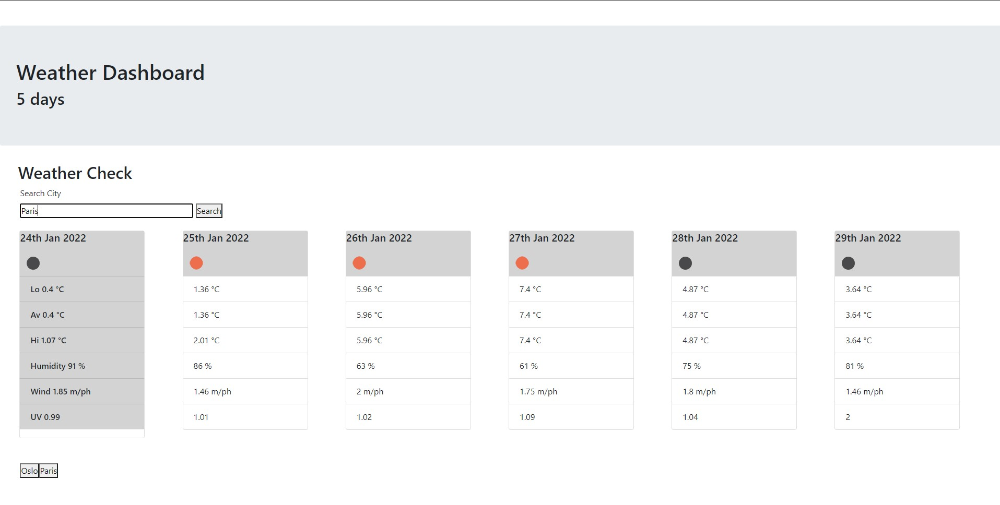

# Weather Dashboard

## Summary
A site presenting city weather forecasts.

## Description / Instructions
Upon loading: Site will show app header, form for city entry, and six cards for the forecast. 

Each time a city name is searched: cards will fill with weather information, and append a button to the bottom of the page.

Clicking on the button will re-display information for that city.

Refreshing the page will reset all buttons and the website. 

Weather information per card includes date up to six days, and for each date:  
Low Temperature (°C)  
Average Temperature (°C)  
High Temperature (°C)  
Humidity (%)  
Wind (m/ph)  
UV (index)  

## Log / Milestones
### 24/01/22
Final upload and readme edit

### 21/01/22
Fully working code. Cosmetic/minor edits. 

### 20/01/22
First upload - base code and partial working code

   

